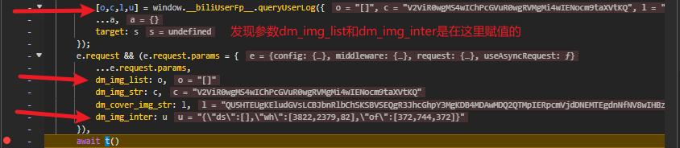
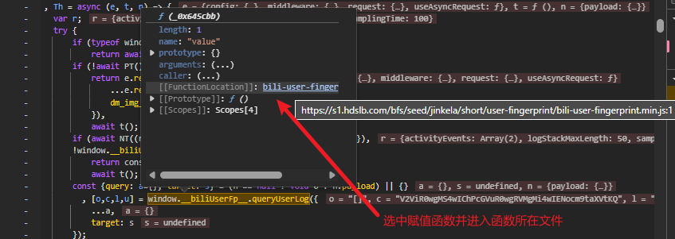

1. 寻找目标资源所在的网络请求
   'https://api.bilibili.com/x/space/wbi/arc/search'
   请求方式： Get
   请求参数：

2. 确认需要逆向的参数
   翻页发现变化的参数有dm_img_list，dm_img_inter，w_webid，w_rid，wts（这个是时间戳就不再关注）

3. 定位参数可能的位置
   在抓包工具中直接搜索dm_img_list，点击搜索结果并设置断点，然后再刷新页面
   

4. 
   

5. 点进来发现是一个被混淆过的文件，我们设置好断点
   

6. 刷新页面，断住之后让代码往下运行，到图中位置停止
   
   发现最后return的列表里的其中两个值就是我们的目标参数值，第一个是dm_img_list,最后一个是dm_img_inter

7. 首先来分析dm_img_list
   
   前面由于我是直接刷新页面所以值为[],此处我在页面内进行翻页，需要鼠标移动所以出现了值
   不难发现它的值是由一堆{"x":4124,"y":224,"z":0,"timestamp":3479078,"k":113,"type":
   0}组成的，所以接下来我们要找到出这个字典的赋值位置，也就是找x,y,z,timestamp,k,type组成的赋值位置

8. 
   我们发现就在原来的位置就有该参数的生成逻辑，在变量赋值处下断点并刷新页面进行调试，尝试还原被混淆的代码（此处断点错误，应该下在函数内部而不是函数外部）

   ```js
   //一个鼠标事件
   const mouse_dict = [	
       {
           "type": "mousemove",
           "x": 663,
           "y": 860,
           "preX": 724,
           "preY": 856,
           "changeDistance": 0,
           "timestamp": 19334288,
           "preType": "mousemove",
           "target": {}
       },
       {
           "type": "mousemove",
           "x": 601,
           "y": 870,
           "preX": 663,
           "preY": 860,
           "changeDistance": 0,
           "timestamp": 19334389,
           "preType": "mousemove",
           "target": {}
       },
       {
           "type": "mousemove",
           "x": 582,
           "y": 877,
           "preX": 601,
           "preY": 870,
           "changeDistance": 0,
           "timestamp": 19334490,
           "preType": "mousemove",
           "target": {}
       },
       {
           "type": "mousemove",
           "x": 575,
           "y": 883,
           "preX": 582,
           "preY": 877,
           "changeDistance": 0,
           "timestamp": 19334597,
           "preType": "mousemove",
           "target": {}
       },
       {
           "type": "click",
           "x": 575,
           "y": 883,
           "preX": 575,
           "preY": 883,
           "changeDistance": 0,
           "timestamp": 19344897,
           "preType": "mousemove",
           "target": {}
       },
       {
           "type": "mousemove",
           "x": 970,
           "y": 299,
           "preX": 575,
           "preY": 883,
           "changeDistance": 0,
           "timestamp": 19346303,
           "preType": "click",
           "target": {}
       },
       {
           "type": "mousemove",
           "x": 965,
           "y": 299,
           "preX": 970,
           "preY": 299,
           "changeDistance": 0,
           "timestamp": 19346405,
           "preType": "mousemove",
           "target": {}
       },
       {
           "type": "mousemove",
           "x": 877,
           "y": 875,
           "preX": 965,
           "preY": 299,
           "changeDistance": 0,
           "timestamp": 19347192,
           "preType": "mousemove",
           "target": {}
       },
       {
           "type": "mousemove",
           "x": 803,
           "y": 890,
           "preX": 877,
           "preY": 875,
           "changeDistance": 0,
           "timestamp": 19347292,
           "preType": "mousemove",
           "target": {}
       },
       {
           "type": "mousemove",
           "x": 555,
           "y": 899,
           "preX": 803,
           "preY": 890,
           "changeDistance": 0,
           "timestamp": 19347392,
           "preType": "mousemove",
           "target": {}
       },
       {
           "type": "mousemove",
           "x": 523,
           "y": 899,
           "preX": 555,
           "preY": 899,
           "changeDistance": 0,
           "timestamp": 19347493,
           "preType": "mousemove",
           "target": {}
       },
       {
           "type": "mousemove",
           "x": 517,
           "y": 895,
           "preX": 523,
           "preY": 899,
           "changeDistance": 0,
           "timestamp": 19347596,
           "preType": "mousemove",
           "target": {}
       },
       {
           "type": "mousemove",
           "x": 539,
           "y": 888,
           "preX": 517,
           "preY": 895,
           "changeDistance": 0,
           "timestamp": 19347696,
           "preType": "mousemove",
           "target": {}
       },
       {
           "type": "mousemove",
           "x": 541,
           "y": 887,
           "preX": 539,
           "preY": 888,
           "changeDistance": 0,
           "timestamp": 19347801,
           "preType": "mousemove",
           "target": {}
       },
       {
           "type": "click",
           "x": 541,
           "y": 887,
           "preX": 541,
           "preY": 887,
           "changeDistance": 0,
           "timestamp": 19468268,
           "preType": "mousemove",
           "target": {}
       },
       {
           "type": "mousemove",
           "x": 970,
           "y": 143,
           "preX": 541,
           "preY": 887,
           "changeDistance": 0,
           "timestamp": 19469378,
           "preType": "click",
           "target": {}
       },
       {
           "type": "mousemove",
           "x": 964,
           "y": 148,
           "preX": 970,
           "preY": 143,
           "changeDistance": 0,
           "timestamp": 19469478,
           "preType": "mousemove",
           "target": {}
       },
       {
           "type": "mousemove",
           "x": 962,
           "y": 152,
           "preX": 964,
           "preY": 148,
           "changeDistance": 0,
           "timestamp": 19469578,
           "preType": "mousemove",
           "target": {}
       },
       {
           "type": "mousemove",
           "x": 897,
           "y": 907,
           "preX": 962,
           "preY": 152,
           "changeDistance": 0,
           "timestamp": 19470223,
           "preType": "mousemove",
           "target": {}
       },
       {
           "type": "mousemove",
           "x": 828,
           "y": 887,
           "preX": 897,
           "preY": 907,
           "changeDistance": 0,
           "timestamp": 19470324,
           "preType": "mousemove",
           "target": {}
       },
       {
           "type": "mousemove",
           "x": 601,
           "y": 855,
           "preX": 828,
           "preY": 887,
           "changeDistance": 0,
           "timestamp": 19470424,
           "preType": "mousemove",
           "target": {}
       },
       {
           "type": "mousemove",
           "x": 552,
           "y": 854,
           "preX": 601,
           "preY": 855,
           "changeDistance": 0,
           "timestamp": 19470524,
           "preType": "mousemove",
           "target": {}
       },
       {
           "type": "mousemove",
           "x": 551,
           "y": 880,
           "preX": 552,
           "preY": 854,
           "changeDistance": 0,
           "timestamp": 19470624,
           "preType": "mousemove",
           "target": {}
       },
       {
           "type": "mousemove",
           "x": 552,
           "y": 897,
           "preX": 551,
           "preY": 880,
           "changeDistance": 0,
           "timestamp": 19470728,
           "preType": "mousemove",
           "target": {}
       },
       {
           "type": "mousemove",
           "x": 552,
           "y": 896,
           "preX": 552,
           "preY": 897,
           "changeDistance": 0,
           "timestamp": 19470829,
           "preType": "mousemove",
           "target": {}
       },
       {
           "type": "mousemove",
           "x": 551,
           "y": 896,
           "preX": 552,
           "preY": 896,
           "changeDistance": 0,
           "timestamp": 19470930,
           "preType": "mousemove",
           "target": {}
       },
       {
           "type": "mousemove",
           "x": 547,
           "y": 886,
           "preX": 551,
           "preY": 896,
           "changeDistance": 0,
           "timestamp": 19471031,
           "preType": "mousemove",
           "target": {}
       },
       {
           "type": "click",
           "x": 547,
           "y": 886,
           "preX": 547,
           "preY": 886,
           "changeDistance": 0,
           "timestamp": 19476742,
           "preType": "mousemove",
           "target": {}
       },
       {
           "type": "mousemove",
           "x": 970,
           "y": 257,
           "preX": 547,
           "preY": 886,
           "changeDistance": 0,
           "timestamp": 19482972,
           "preType": "click",
           "target": {}
       },
       {
           "type": "mousemove",
           "x": 965,
           "y": 257,
           "preX": 970,
           "preY": 257,
           "changeDistance": 0,
           "timestamp": 19483082,
           "preType": "mousemove",
           "target": {}
       },
       {
           "type": "mousemove",
           "x": 943,
           "y": 838,
           "preX": 965,
           "preY": 257,
           "changeDistance": 0,
           "timestamp": 19483854,
           "preType": "mousemove",
           "target": {}
       },
       {
           "type": "mousemove",
           "x": 896,
           "y": 844,
           "preX": 943,
           "preY": 838,
           "changeDistance": 0,
           "timestamp": 19483954,
           "preType": "mousemove",
           "target": {}
       },
       {
           "type": "mousemove",
           "x": 752,
           "y": 846,
           "preX": 896,
           "preY": 844,
           "changeDistance": 0,
           "timestamp": 19484054,
           "preType": "mousemove",
           "target": {}
       },
       {
           "type": "mousemove",
           "x": 638,
           "y": 863,
           "preX": 752,
           "preY": 846,
           "changeDistance": 0,
           "timestamp": 19484154,
           "preType": "mousemove",
           "target": {}
       },
       {
           "type": "mousemove",
           "x": 550,
           "y": 887,
           "preX": 638,
           "preY": 863,
           "changeDistance": 0,
           "timestamp": 19484254,
           "preType": "mousemove",
           "target": {}
       },
       {
           "type": "mousemove",
           "x": 532,
           "y": 890,
           "preX": 550,
           "preY": 887,
           "changeDistance": 0,
           "timestamp": 19484367,
           "preType": "mousemove",
           "target": {}
       },
       {
           "type": "click",
           "x": 532,
           "y": 890,
           "preX": 532,
           "preY": 890,
           "changeDistance": 0,
           "timestamp": 22726860,
           "preType": "mousemove",
           "target": {}
       },
       {
           "type": "mousemove",
           "x": 789,
           "y": 153,
           "preX": 532,
           "preY": 890,
           "changeDistance": 0,
           "timestamp": 22738469,
           "preType": "click",
           "target": {}
       },
       {
           "type": "mousemove",
           "x": 778,
           "y": 155,
           "preX": 789,
           "preY": 153,
           "changeDistance": 0,
           "timestamp": 22738582,
           "preType": "mousemove",
           "target": {}
       },
       {
           "type": "mousemove",
           "x": 786,
           "y": 157,
           "preX": 778,
           "preY": 155,
           "changeDistance": 0,
           "timestamp": 22738682,
           "preType": "mousemove",
           "target": {}
       },
       {
           "type": "mousemove",
           "x": 787,
           "y": 158,
           "preX": 786,
           "preY": 157,
           "changeDistance": 0,
           "timestamp": 22738784,
           "preType": "mousemove",
           "target": {}
       },
       {
           "type": "mousemove",
           "x": 448,
           "y": 25,
           "preX": 787,
           "preY": 158,
           "changeDistance": 0,
           "timestamp": 22747493,
           "preType": "mousemove",
           "target": {}
       },
       {
           "type": "mousemove",
           "x": 785,
           "y": 238,
           "preX": 448,
           "preY": 25,
           "changeDistance": 0,
           "timestamp": 22747593,
           "preType": "mousemove",
           "target": {}
       },
       {
           "type": "mousemove",
           "x": 787,
           "y": 241,
           "preX": 785,
           "preY": 238,
           "changeDistance": 0,
           "timestamp": 22747694,
           "preType": "mousemove",
           "target": {}
       },
       {
           "type": "mousemove",
           "x": 786,
           "y": 241,
           "preX": 787,
           "preY": 241,
           "changeDistance": 0,
           "timestamp": 22747839,
           "preType": "mousemove",
           "target": {}
       },
       {
           "type": "mousemove",
           "x": 778,
           "y": 241,
           "preX": 786,
           "preY": 241,
           "changeDistance": 0,
           "timestamp": 22747939,
           "preType": "mousemove",
           "target": {}
       },
       {
           "type": "mousemove",
           "x": 789,
           "y": 713,
           "preX": 778,
           "preY": 241,
           "changeDistance": 0,
           "timestamp": 22758875,
           "preType": "mousemove",
           "target": {}
       },
       {
           "type": "mousemove",
           "x": 641,
           "y": 819,
           "preX": 789,
           "preY": 713,
           "changeDistance": 0,
           "timestamp": 22758975,
           "preType": "mousemove",
           "target": {}
       },
       {
           "type": "mousemove",
           "x": 576,
           "y": 865,
           "preX": 641,
           "preY": 819,
           "changeDistance": 0,
           "timestamp": 22759075,
           "preType": "mousemove",
           "target": {}
       },
       {
           "type": "mousemove",
           "x": 571,
           "y": 869,
           "preX": 576,
           "preY": 865,
           "changeDistance": 0,
           "timestamp": 22759176,
           "preType": "mousemove",
           "target": {}
       }
   ]
   
   const event = {
       click: 1,
       focus: 5,
       keydown: 2,
       mousemove: 0,
       touch: 4,
       wheel: 3
   }
   
   const elements_dict = {
       a: 4,
       article: 29,
       button: 7,
       div: 2,
       em: 27,
       form: 17,
       h1: 11,
       h2: 12,
       h3: 13,
       h4: 14,
       h5: 15,
       h6: 16,
       img: 5,
       input: 6,
       label: 25,
       li: 10,
       ol: 9,
       option: 20,
       p: 3,
       section: 28,
       select: 19,
       span: 1,
       strong: 26,
       table: 21,
       td: 23,
       textarea: 18,
       th: 24,
       tr: 22,
       ul: 8
   }
   
   const key = ['Mg', 'Mw', 'NA', 'NQ']
   
   const boundingclientrect = {
       '1': {
           "x": 418.796875,
           "y": 2011.75,
           "width": 34,
           "height": 34,
           "top": 2011.75,
           "right": 452.796875,
           "bottom": 2045.75,
           "left": 418.796875
       },
       '2': {
           "x": 564.796875,
           "y": 2399.1875,
           "width": 34,
           "height": 34,
           "top": 2399.1875,
           "right": 598.796875,
           "bottom": 2433.1875,
           "left": 564.796875
       },
       '上一页': {
           "x": 0,
           "y": 0,
           "width": 0,
           "height": 0,
           "top": 0,
           "right": 0,
           "bottom": 0,
           "left": 0
       },
       '下一页': {
           "x": 0,
           "y": 0,
           "width": 0,
           "height": 0,
           "top": 0,
           "right": 0,
           "bottom": 0,
           "left": 0
       }
   }
   
   f1 = function (args) {
       return Math["floor"](114 * Math["random"]() * args);
   }
   
   f2 = function (args) {
       return Number(atob(key[args] + '=='));
   }
   
   f3 = function (args1, args2, args3, args4, args5, args6) {
       var a, b, c = f1(args5);
       return void 0 !== args1 && void 0 !== args2 ? (a = f2(1) * args1 + f2(0) * args2 + c,
           b = f2(2) * args1 - f2(3) * args2 + c) : (a = f2(1) * c + f2(0) * c + c,
           b = f2(2) * c - f2(3) * c),
           [a, b, c, args3, args6 ? args6["charCodeAt"](0) : Math["floor"](67 * Math["random"]()) + 60, event[args4]];
   }
   
   f4 = function (args) {
       var arraybuffer = new TextEncoder()["encode"](args)["buffer"],
           uint8array = new Uint8Array(arraybuffer),
           webinfo = btoa(String["fromCharCode"]["apply"](null, uint8array));
       return webinfo["substring"](0, webinfo["length"] - 2);
   }
   
   dom_info = function (_0x645cbb) {
       // var _0x2d5ecc = _0x645cbb["preTime"]
       //     , _0x268943 = _0x645cbb['startTime']
       //     , _0x366fc6 = _0x645cbb['endTime']
       //     , _0x44234a = _0x645cbb["target"];
       // if (!this["instance"]) {
       //     var _0x398e6b = window["__USER_FP_CONFIG__"];
       //     this["init"](_0x398e6b || {});
       // }
   
       var dm_img_list = function (event_lists) {
           var another_lists = event_lists["map"](function (list, index) {
               var temp1 = list['x']
                   , a = void 0 === temp1 ? 0 : temp1
                   , temp2 = list['y']
                   , b = void 0 === temp2 ? 0 : temp2
                   , c = list["timestamp"]
                   , d = list["type"]
                   , e = list["key"];
               return f3(a, b, c, d, index, e);
           })
               , lists_again = another_lists['map'](function (list) {
               return {
                   'x': list[0],
                   'y': list[1],
                   'z': list[2],
                   'timestamp': list[3],
                   'k': list[4],
                   'type': list[5]
               };
           });
           try {
               return JSON["stringify"](lists_again);
           } catch (e) {
               return console["log"](e),
                   '';
           }
       }(mouse_dict);
   
       var list = ['g', 'w', 'A', 'Q'],
           n1 = Number(atob("M" + list[0] + "")),
           n2 = Number(atob("M" + list[1] + "")),
           n3 = Number(atob("N" + list[2] + "")),
           _0x186aea = (Number(atob("N" + list[3] + "")))
   
       f5 = function (array, index) {
           var a = function (a1) {
               if (Array["isArray"](a1))
                   return a1;
           }
           return a(array);
       }
   
       f6 = function (args) {
           var arrary = f5(args, 2)
               , a = arrary[0]
               , b = arrary[1]
               , c = Math["floor"](114 * Math["random"]());
           return [n1 * a + n1 * b + n2 * c, n3 * a - b + c, c];
       }
   
       f7 = function (args) {
           var array = f5(args, 2)
               , a = array[0]
               , b = array[1]
               , c = Math['floor'](514 * Math["random"]());
           return [n2 * a + n1 * b + c, n3 * a - n3 * b + n1 * c, c];
       }
       
       f8 = function (args) {
           if (!args)
               return [0, 0, 0, 0];
           // var ele = args['getBoundingClientRect']();
           var key = args.match(/<.*>(.*?)<.*>/)[1]
           var ele = boundingclientrect[key]
           return [~~ele['top'], ~~ele['left'], ~~ele['width'], ~~ele['height']];  //获取DOM元素相对于页面的位置,需要修改，按钮1，2一般宽高都是34，上下一页则是100x34
       }
   
       f9 = function (args) {
           var tagName;
           if (!args)
               return 0;
           var key = null === (tagName = args.match(/<([a-zA-Z0-9\\-_]+)[^>]*>/)[1]) || void 0 === tagName ? void 0 : tagName['toLowerCase']();
           return elements_dict[key] || 0;   //获取DOM元素的tagName，一般来说是button，则返回结果是7，此处改成直接获取字符串中的指定字符
       }
   
       f10 = function (args) {
           return f4((null == args ? void 0 : args.match('class="(.*?)"')[1]) || '');   //获取DOM匀速的className内容，并用f4函数进行加密处理，内容如下面的"vui_button vui_button--disabled vui_pagenation--btn vui_pagenation--btn-side"
       }
   
       f11 = function (args1, args2) {
           // var e_list = [];
           const buttom_list = [
               '<button class="vui_button vui_button--disabled vui_pagenation--btn vui_pagenation--btn-side" disabled="">上一页</button>',
               '<button class="vui_button vui_button--active vui_button--active-blue vui_button--no-transition vui_pagenation--btn vui_pagenation--btn-num">1</button>',
               '<button class="vui_button vui_button--active vui_button--active-blue vui_button--no-transition vui_pagenation--btn vui_pagenation--btn-num">2</button>',
               '<button class="vui_button vui_button--disabled vui_pagenation--btn vui_pagenation--btn-side" disabled="">下一页</button>'
           ]
           // const buttom_list = [
           //     '<button class="vui_button vui_button--disabled vui_pagenation--btn vui_pagenation--btn-side" disabled="">上一页</button>',
           //     '<button class="vui_button vui_button--disabled vui_pagenation--btn vui_pagenation--btn-side" disabled="">下一页</button>'
           // ]
           var randomindex = Math.floor(Math.random() * buttom_list.length)
           // var e_list = ['<button class="vui_button vui_button--disabled vui_pagenation--btn vui_pagenation--btn-side" disabled="">下一页</button>']  //这是args1中最后一个元素的值的target,但是我们无法获取DOM元素，所以改为直接存储，这里还需要获取更多元素来使其具备普遍性
           var e_list = [buttom_list[randomindex]]
   
           // if (args2) {
           //     if ('string' == typeof args2) {
           //         var _0x3c5e24 = document["querySelectorAll"]('div[data-v-risk="'['concat'](args2, '\x22]'));
           //         _0x3c5e24['length'] && e_list['push']['apply'](e_list, _0x557c8d()(Array['from'](_0x3c5e24)));
           //     } else
           //         Array['isArray'](args2) ? args2['forEach'](function (_0x1cf1b5) {
           //             if ('string' == typeof _0x1cf1b5) {
           //                 var _0x43e280 = document['querySelectorAll']('div[data-v-risk=\x22'['concat'](args2, '\x22]'));
           //                 _0x43e280['length'] && e_list['push']['apply'](e_list, _0x557c8d()(Array['from'](_0x43e280)));
           //             } else
           //                 e_list['push'](_0x1cf1b5);
           //         }) : 'object' === _0x2a557f()(args2) ? e_list['push'](args2) : console['error']('target type error');
           // } else {
           //     if (args1['length']) {
           //         var _0x3c0101 = args1[args1['length'] - 1];
           //         _0x3c0101 && _0x3c0101['target'] && e_list['push'](_0x3c0101['target']);
           //     } else {
           //         var _0x5da5f1 = document['querySelectorAll']('div[data-v-risk="'['concat']('fingerprint', '\x22]'));
           //         _0x5da5f1['length'] && e_list['push']['apply'](e_list, _0x557c8d()(Array['from'](_0x5da5f1)));
           //     }
           // }
           return e_list ? e_list['map'](function (element) {
               return temp1 = f8(temp0 = element),
                   a_list = f5(temp1, 4),
                   a = a_list[0],
                   b = a_list[1],
                   c = a_list[2],
                   d = a_list[3],
                   temp2 = f6([a, b]),
                   b_list = f5(temp2, 3),
                   e = b_list[0],
                   f = b_list[1],
                   g = b_list[2],
                   temp3 = f7([c, d]),
                   c_list = f5(temp3, 3),
                   h = c_list[0],
                   i = c_list[1],
                   j = c_list[2],
                   {
                       't': f9(temp0),
                       'c': f10(temp0),
                       'p': [e, g, f],
                       's': [j, h, i]
                   };
               var temp0, temp1, a_list, a, b, c, d, temp2, b_list, e, f, g, temp3, c_list, h, i, j;
           }) : [];
       }
   
       var dm_img_inter = function (args) {
           var dm_img_inter = {
               'ds': f11(mouse_dict, args),
               'wh': f6([~~this["winWidth"], ~~this['winHeight']]),
               'of': f7([~~this["scrollTop"], ~~this["scrollLeft"]])
           };
           try {
               return JSON['stringify'](dm_img_inter);
           } catch (e) {
               return '';
           }
       }()
   
       return [dm_img_list, f4("WebGL 1.0 (OpenGL ES 2.0 Chromium)"), f4("ANGLE (Intel, Intel(R) UHD Graphics (0x000046A3) Direct3D11 vs_5_0 ps_5_0, D3D11)Google Inc. (Intel)"), dm_img_inter];
   }
   
   //注意：被注释掉的部分是并非不需要，而是网站在遇到其他情况时的处理（异常处理之类的），因为我们时奔着不出现异常的情况来处理的，同时有些代码还需要操作DOM文档，而我没有采用自动化的方式去操作文档获取内容，因为效率会很低，所以注释了，转而自己构建和模拟数据来进行操作。
   ```

9. 我发现混淆的代码还原还是太费时间了，如果写具体步骤会很费时，这里为了效率先不写了

10. 使用python调用该js文件来生成dom信息并传入params来进行爬虫

```python
import requests, subprocess, json, time, random, tqdm, re, pprint, hashlib
from functools import partial
from urllib.parse import unquote, quote

subprocess.Popen = partial(subprocess.Popen, encoding='utf-8')
import execjs

session = requests.Session()
timestamp = int(time.time())


def get_w_webid(mid, session):
    headers = {
        'referer': f'https://space.bilibili.com/{mid}',
        'user-agent': 'Mozilla/5.0 (Windows NT 10.0; Win64; x64) AppleWebKit/537.36 (KHTML, like Gecko) Chrome/135.0.0.0 Safari/537.36 Edg/135.0.0.0',
    }
    # 给拿w_webid用的，现在也用不上了
    url = f'https://space.bilibili.com/{mid}/upload/video'
    try:
        resp = session.get(url, headers=headers)
        data = resp.text
        resp.close()
        w_webid = re.findall('<script id="__RENDER_DATA__" type="application/json">(.*?)</script>', data, re.S)[0]
        w_webid = json.loads(unquote(w_webid))['access_id']
    except IndexError:
        print(resp.text)
    return w_webid


def get_dom_info():
    with open('../dom_info.js', 'r', encoding='utf-8') as f:
        js_code = f.read()
        js = execjs.compile(js_code)
        result = js.call('dom_info', )
        return result


def get_w_rid(dm_cover_img_str, dm_img_inter, dm_img_list, dm_img_str, mid, pn, w_webid, timestamp):
    f = [
        f"dm_cover_img_str={dm_cover_img_str}",
        f'dm_img_inter={quote(dm_img_inter)}',
        f"dm_img_list={quote(dm_img_list)}",
        f"dm_img_str={dm_img_str}",
        "index=0",
        "keyword=",
        f"mid={mid}",
        "order=pubdate",
        "order_avoided=true",
        "platform=web",
        f"pn={pn}",
        "ps=40",
        "special_type=",
        "tid=0",
        f"w_webid={w_webid}",
        "web_location=333.1387",
        f"wts={timestamp}"
    ]
    args = '&'.join(f)
    key = 'ea1db124af3c7062474693fa704f4ff8'
    strings = args + key
    md5 = hashlib.md5()
    md5.update(strings.encode(('utf-8')))
    w_rid = md5.hexdigest()
    return w_rid


def main():
    pn = input('请输入页码:')
    mid = input('请输入用户的mid:')
    dom_info = get_dom_info()
    dm_img_list = dom_info[0]
    dm_img_str = dom_info[1]
    dm_cover_img_str = dom_info[2]
    dm_img_inter = dom_info[3]
    w_webid = get_w_webid(mid, session)
    w_rid = get_w_rid(dm_cover_img_str, dm_img_inter, dm_img_list, dm_img_str, mid, pn, w_webid, timestamp)

    headers = {
        'referer': f'https://space.bilibili.com/{mid}/upload/video',
        'user-agent': 'Mozilla/5.0 (Windows NT 10.0; Win64; x64) AppleWebKit/537.36 (KHTML, like Gecko) Chrome/135.0.0.0 Safari/537.36 Edg/135.0.0.0',
    }

    params = [
        f'pn={pn}',
        'ps=40',
        'tid=0',
        'special_type=',
        'order=pubdate',
        f'mid={mid}',
        'index=0',
        'keyword=',
        'order_avoided=true',
        'platform=web',
        'web_location=333.1387',
        f'dm_img_list={dm_img_list}',
        f'dm_img_str={dm_img_str}',
        f'dm_cover_img_str={dm_cover_img_str}',
        f'dm_img_inter={dm_img_inter}',
        f'w_webid={w_webid}',
        f'w_rid={w_rid}',
        f'wts={timestamp}'
    ]

    url = 'https://api.bilibili.com/x/space/wbi/arc/search?' + '&'.join(params)
    resp = session.get(url, headers=headers)
    pprint.pprint(resp.json())
    resp.close()


if __name__ == '__main__':
    main()
```

